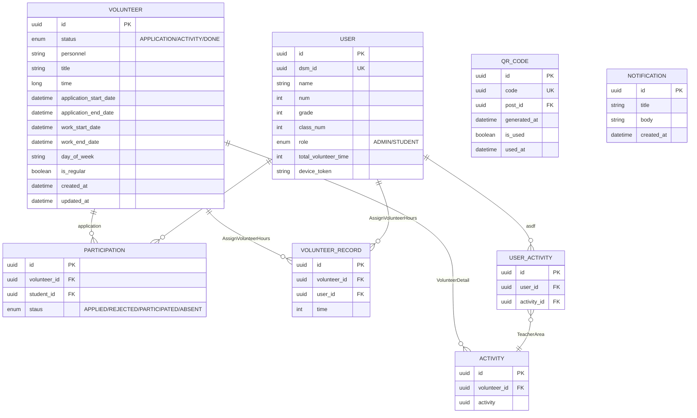

# Finda-Backend

```mermaid
erDiagram
	VOLUNTEER{
		uuid id PK
		enum status "APPLICATION/ACTIVITY/DONE"
		string personnel 
		string title
		long time
    datetime application_start_date 
    datetime application_end_date
    datetime work_start_date
    datetime work_end_date
    string day_of_week
    boolean is_regular
    datetime created_at
    datetime updated_at
	}
	PARTICIPATION{
		uuid id PK
		uuid volunteer_id FK
		uuid student_id FK
		enum staus "APPLIED/REJECTED/PARTICIPATED/ABSENT"
	}
	VOLUNTEER_RECORD{
		uuid id PK
		uuid volunteer_id FK
		uuid user_id FK
		int time
		%%string title << 이게 중복값이긴한데 마이페이지에서 본인 봉사활동 조회할 거 생각하면 매번 volunteer랑 조인하는것도 좀 그렇지 않나 싶긴합니다
	}
	USER{
		uuid id PK
		uuid dsm_id UK
		string name
		int num
		int grade
		int class_num
		enum role "ADMIN/STUDENT"
		int total_volunteer_time
		string device_token
	}
	ACTIVITY{
		uuid id PK
		uuid volunteer_id FK
		uuid activity
	}
	USER_ACTIVITY{
		uuid id PK
		uuid user_id FK
		uuid activity_id FK
	}
	QR_CODE {
     uuid id PK
     uuid code UK
     uuid post_id FK
     datetime generated_at
     boolean is_used
     datetime used_at
   }
   NOTIFICATION {
     uuid id PK
     string title
     string body
     datetime created_at
   }
	
	VOLUNTEER ||--o{ VOLUNTEER_RECORD : AssignVolunteerHours
	USER ||--o{ VOLUNTEER_RECORD : AssignVolunteerHours
	VOLUNTEER ||--o{ PARTICIPATION : application
	USER ||--o{ PARTICIPATION : application
	VOLUNTEER ||--o{ ACTIVITY : VolunteerDetail
	USER_ACTIVITY }o--|| ACTIVITY : TeacherArea
	USER ||--o{ USER_ACTIVITY : asdf
```
